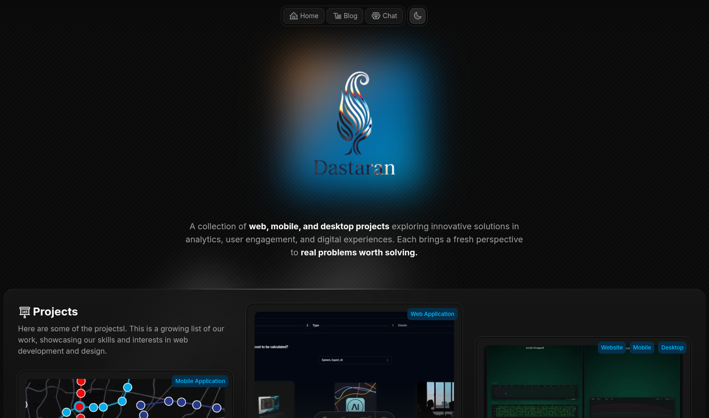

# Company portfolio website

Source code for Dastaran website. The site showcases my projects and gives an insight into my background, my passion for web development and design, and the technologies I work with.

## ✨ Features

- **Modern Technologies**: Built with [Astro](https://astro.build/), [TypeScript](https://www.typescriptlang.org/), and [Tailwind CSS](https://tailwindcss.com/).
- **Homepage**: A homepage with a brief introduction, a list of projects, my skills, work experience, and contact information.
- **Personal blog**: A [blog section](https://www.dastaran.com/blog) to share my thoughts and experiences. Posts are Markdown loaded from a backend API at build time.
- **SEO**: Optimized for search engines and social sharing
- **Accessibility**: Build on top of [Base UI](https://radix-ui.com/) and [shadcn/ui](https://ui.shadcn.com/docs) for accessible, modern and inclusive design.
